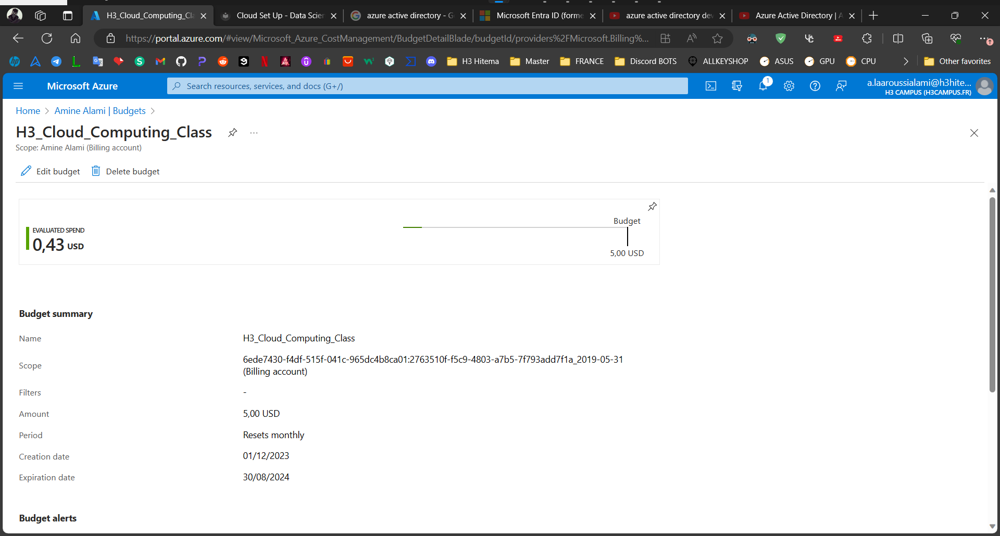

# Cloud project tasks

### Ceate a Virtual Machine (VM) :

### Set Up Blob Storage :

### Deploy a Web App :

### Create a SQL Database :

`The app is succesfully connected to cosmosdb`

### Implement a simple Azure Functions :

`Testing the function...`

### Set Up a Networking ressource :

### Configure Monitoring and Logging :

### Create a personalized Resource Group :

Set Up Auto-Scaling :

